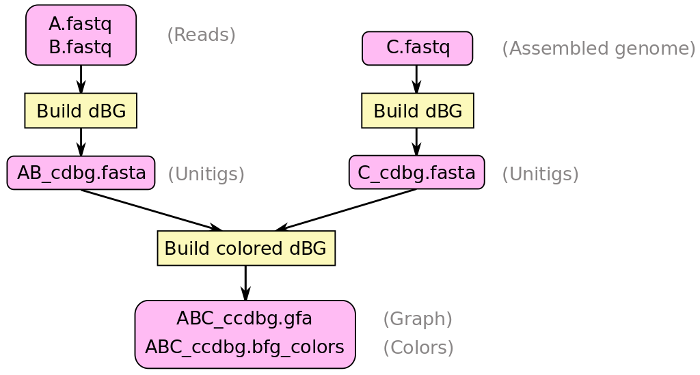

# Bifrost

### Highly Parallel and Memory Efficient Construction of a Colored Compacted de Bruijn Graph

* **Build**, **index** and **color** the compacted de Bruijn graph
* **No need to build the uncompacted** de Bruijn graph
* **Reads** or **assembled genomes** as input
* Output **graph in GFA** (can be visualized with [Bandage](https://github.com/rrwick/Bandage))
* **Graph cleaning**: short tip clipping, etc.
* **No disk** usage (adapted for cluster architectures)
* **Multi-threaded** and **SIMD** optimized
* **No parameters to estimate** with other tools
* **C++ API** available:
    * Associate **your data with vertices**
    * **Add** or **remove** (sub-)sequences or k-mers
    * **Find unitigs** containing **queried k-mers**

## Requirements

* 64 bits POSIX-compliant UNIX or MacOS operating system
* C++11 capable compiler:
    * [GCC](https://gcc.gnu.org/) 5.0 or later
    * [Clang](http://clang.llvm.org/) 3.5 or later
* [Cmake](https://cmake.org/) 2.8.12 or later
* [Zlib](https://zlib.net/)

GCC/Clang, Cmake and Zlib are probably already installed on your computer (those are installed by default on most operating systems) but they can be downloaded and installed by following the instructions on their respective websites. It is most likely that all are available via a package manager for your operating system: 

* Ubuntu/Debian:
```
sudo apt-get install build-essential cmake zlib1g
```
* MacOS (with [Homebrew](https://brew.sh/)):
```
brew install --with-toolchain llvm
brew install cmake zlib
```

## Compilation and Installation

```
cd <bifrost_directory>
mkdir build
cd build
cmake ..
make
make install
```

`make install` might requires `sudo` (`sudo make install`) to proceed. See [Troubleshooting](#troubleshooting) if you have any problem during the installation.

By default, the installation creates:
* a binary (*Bifrost*)
* a dynamic library (*libbifrost.so* for Unix or *libbifrost.dylib* for MacOS)
* a static library (*libbifrost.a*).

The default maximum *k*-mer size supported is 31. To work with larger *k*, you must replace *MAX_KMER_SIZE* in *CMakeLists.txt* with a larger (appropriate) number, such as:
```
set( MAX_KMER_SIZE "64")
```

In this case, the maximum *k* allowed is 63. Keep in mind that increasing *MAX_KMER_SIZE* increases Bifrost memory usage (*k*=31 uses 8 bytes of memory per *k*-mer while *k*=63 uses 16 bytes of memory per *k*-mer).

## Binary usage:

```
Bifrost
```

displays the command line interface:
```
Bifrost x.y

Highly Parallel and Memory Efficient Colored and Compacted de Bruijn Graph Construction

Usage: Bifrost [Parameters] -o <output_prefix> -f <file_1> ...

Mandatory parameters with required argument:

  -f, --input-files        Input sequence files (FASTA or FASTQ, possibly gziped) and/or graph files (GFA)
  -o, --output-file        Prefix for output file (GFA output by default)

Optional parameters with required argument:

  -t, --threads            Number of threads (default is 1)
  -k, --kmer-length        Length of k-mers (default is 31)
  -g, --min-length         Length of minimizers (default is 23)
  -n, --num-kmers          Estimated number of different k-mers in input files (default: KmerStream estimation)
  -N, --num-kmers2         Estimated number of different k-mers occurring twice or more in the input files (default: KmerStream estimation)
  -b, --bloom-bits         Number of Bloom filter bits per k-mer occurring at least once in the input files (default is 14)
  -B, --bloom-bits2        Number of Bloom filter bits per k-mer occurring at least twice in the input files (default is 14)
  -l, --load-mbbf          Filename for input Blocked Bloom Filter, skips filtering step (default is no input)
  -w, --write-mbbf         Filename for output Blocked Bloom Filter (default is no output)
  -s, --chunk-size         Read chunksize to split between threads (default is 64)

Optional parameters with no argument:

  -p, --produce-colors     Produce a colored and compacted de Bruijn graph
  -r, --reference          Reference mode, no filtering
  -i, --clip-tips          Clip tips shorter than k k-mers in length
  -d, --del-isolated       Delete isolated contigs shorter than k k-mers in length
  -m, --keep-mercy         Keep low coverage k-mers connecting tips
  -a, --fasta              Output file is in FASTA format (only sequences) instead of GFA
  -v, --verbose            Print information messages during construction
```

Bifrost works in two steps:

1. reads are filtered to remove errors (*k*-mers with occurrence 1)
2. the compacted de Bruijn graph is built from the filtered reads

If you want to input assembled genomes, use the `-r` parameter and no filtering will be applied, all k-mers of the files will be used to build the graph.

### Without colors

By default, Bifrost produces a compacted de Bruijn graph without colors.

### With colors (pre-alpha)

Colors are used to annotate k-mers with the set of genomes/samples in which they occur. Producing a colored and compacted de Bruijn graph using Bifrost is a two steps process:

1. **Build the compacted de Bruijn graph for each set of read files (not for assembled genomes) and output the unitigs to FASTA (`-a` parameter)**

   Example: Four input files *A.fastq*, *B.fastq*, *C.fastq* and *D.fastq*. A and B are paired-end reads from one genome, C is reads from another genome and D is an assembled genome.
   ```
   Bifrost -k 31 -t 4 -i -d -a -o AB_unitigs -f A.fastq B.fastq
   Bifrost -k 31 -t 4 -i -d -a -o C_unitigs -f C.fastq 
   ```
   In this example, each compacted de Bruijn graph is built using 31-mers (`-k 31`) and 4 threads (`-t 4`). Graph simplification steps are performed after construction (`-i -d`) and the unitigs are output to FASTA files *AB_unitigs.fasta* (`-a -o AB_unitigs`) and *C_unitigs.fasta* (`-a -o C_unitigs`). It was not necessary to build the compacted de Bruijn graph for *D.fastq* as it is already an assembled genome.

2. **Build the colored and compacted de Bruijn graph (`-p` parameter) using in input the previously produced FASTA files and your assembled genomes (if you have some)**

   Example: Three input files *AB_unitigs.fasta*, *C_unitigs.fasta* and *D.fastq*. *AB_unitigs.fasta* and *C_unitigs.fasta* are unitigs. *D.fastq* is an assembled genome.
   ```
   Bifrost -k 31 -t 4 -p -o ABCD -f AB_unitigs.fasta C_unitigs.fasta D.fastq
   ```
   In this example, the colored (`-p`) and compacted de Bruijn graph is built using 31-mers (`-k 31`) and 4 threads (`-t 4`) from the files *AB_unitigs.fasta*, *C_unitigs.fasta* and *D.fastq* (`-f AB_unitigs.fasta C_unitigs.fasta D.fastq`). The graph will be output to a GFA file *ABCD.gfa* and colors will be output to file *ABCD.bfg_colors* (`-o ABCD`).

<p align="center">

</p>

## API

(Work in progress)

### Documentation

Documentation for the Bifrost library is available in the */doc/doxygen* folder (HTML version, open *html/index.html*).

The following command regenerates the documentation:
```
cd <bifrost_directory>
doxygen Doxyfile
```

The documentation contains a description of all the functions and structures of the library.

### Usage

Once Bifrost is installed on your operating system, just use
```
#include <bifrost/CompactedDBG.hpp>
```
in your C++ code. Then, use the following flags for compiling:
```
-O3 -std=c++11 -march=native
```

and the following flags for linking:
```
-lbifrost -pthread -lz
```

You can also link to the Bifrost static library (*libbifrost.a*) for better performance:
```
<path_to_lib_folder>/libbifrost.a -pthread -lz
```

### With colors (pre-alpha)

As a pre-alpha version, the ColoredCDBG API might be unstable and change in the future.

```
#include <bifrost/ColoredCDBG.hpp>
```

## FAQ

**What are the accepted input file formats?**

FASTA , FASTQ and GFA. Input FASTA and FASTQ files can be compressed with gzip (extension .gz). If you input a GFA file, you probably want to run Bifrost in reference mode (`-r` parameter, build the graph from all k-mers of the sequences).

**Can I mix different file formats in input?**

Yes, as long as they are FASTA, FASTQ and GFA.

**If I input a GFA file, does it need to contain already a compacted de Bruijn graph?**

No, it can contain any type of sequence graph (like an uncompacted de Bruijn graph). Bifrost will extract the sequences from the file and build the compacted de Bruijn graph out of them. Don't forget that if you input a GFA file, you probably want to run Bifrost in reference mode (`-r` parameter, build the graph from all k-mers of the sequences).

**Can I build a compacted de Bruijn graph from assembled genomes and reads?**

Yes. First, run Bifrost with your read files only and output the unitigs to a FASTA file (`-a` parameter). Then, run Bifrost in reference mode (`-r` parameter) with the previously produced unitigs in FASTA files and your assembled genomes.

## Troubleshooting

The following might happen when environment variables are not set correctly on your system:

* compilation (`make`) fails because some header files (*.h*) are not found

Assuming the header files (*.h*) are located at the path */usr/local/include/*, the following command set the environment variables *C_INCLUDE_PATH* and *CPLUS_INCLUDE_PATH* correctly for the time of the session:
```
export C_INCLUDE_PATH=$C_INCLUDE_PATH:/usr/local/include/
export CPLUS_INCLUDE_PATH=$CPLUS_INCLUDE_PATH:/usr/local/include/
```

* executing the binary of Bifrost fails because *libbifrost.so* or *libbifrost.a* is not found

Assuming that *libbifrost*.(*so*|*dylib*|*a*) is located at the path */usr/local/lib/*, the following command set the environment variables *LD_LIBRARY_PATH*, *LIBRARY_PATH* and *PATH* correctly for the time of the session:
```
export LD_LIBRARY_PATH=$LD_LIBRARY_PATH:/usr/local/lib/
export LIBRARY_PATH=$LIBRARY_PATH:/usr/local/lib/
export PATH=$PATH:/usr/local/lib/
```

## Contact

For any question, feedback or problem, please feel free to file an issue on this GitHub repository and we will get back to you as soon as possible.

## License

* The hash function library xxHash is BSD licensed (https://github.com/Cyan4973/xxHash)

* The popcount library is BSD licensed (https://github.com/kimwalisch/libpopcnt)

* The libdivide library is zlib licensed (https://github.com/ridiculousfish/libdivide)

* The kseq library is copyrighted by Heng Li and released
  under the MIT license (http://lh3lh3.users.sourceforge.net/kseq.shtml)

* The CRoaring library is Apache 2.0 licensed (https://github.com/RoaringBitmap/CRoaring)

*   This program is free software: you can redistribute it and/or modify
    it under the terms of the GNU General Public License as published by
    the Free Software Foundation, either version 3 of the License, or
    (at your option) any later version.

    This program is distributed in the hope that it will be useful,
    but WITHOUT ANY WARRANTY; without even the implied warranty of
    MERCHANTABILITY or FITNESS FOR A PARTICULAR PURPOSE.  See the
    GNU General Public License for more details.

    You should have received a copy of the GNU General Public License
    along with this program.  If not, see <http://www.gnu.org/licenses/>.
